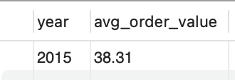

## Pizza Project End to End project (Excel, SQL, Tableau)

##### By: Steven Nguyen

## Introduction

In this project I will use MySQL to explore and analyze data than I will use Tableau to visulize the data and provide final insights for the pizzeria. The dataset provided is a free dataset that is made publicly available on Maven Analytics.

## Objective
As a data analyst hired by a pizza company, my objective is to make data-driven decisions to enhance their overall business performance and identify trends. To achieve this, I will address the following questions and more:

1. What days and times experience the highest customer traffic?
2. How many pizzas are typically sold during peak periods?
3. Which pizzas are the best and worst sellers?
4. What is the average order value?

	
## Stakeholders

    1. Tim Vo - Store Manager 
    2. Jerry Do - Owner

#### Excel- Before importing datasets into MySql I check for duplicates and any issues that may cause issues importing data into MySql. There was no duplicates but there was a special character in front of Nduja Salami in pizza_types table which would of caused an error if imported it in MySql. 

#### Examining all the tables before starting
```
SELECT * FROM order_details;-- shows orders ID ,order details ID, pizza and quantity of pizza
SELECT * FROM orders; -- shows order ID, date & time
SELECT * FROM pizzas; -- shows pizza id,pizza type id, size & price
SELECT * FROM pizza_types; -- pizza type id, name of pizza, category & ingredients
```

### STEPS
#### 1. Seeing the average order value.
```
SELECT EXTRACT(YEAR FROM o.date) AS year,
       ROUND(AVG(p.price * d.quantity), 2) AS avg_order_value
FROM pizzas AS p
JOIN order_details AS d ON d.pizza_id = p.pizza_id
JOIN orders AS o ON o.order_id = d.order_id
GROUP BY year;
```
<!-- -->

#### 2. Average orders by day of the week
```
SELECT DAYNAME(date) AS day_of_week,
       ROUND(AVG(daily_orders),2) as avg_orders_per_day
FROM (
    SELECT date, COUNT(order_id) as daily_orders
    FROM orders
    GROUP BY date
) as daily_order_counts
GROUP BY day_of_week
ORDER BY AVG(daily_orders) DESC;
```
<!-- -->

#### 3. Finding the busiest day of the week 
```
SELECT DAYNAME(date) AS day_of_week,
       COUNT(order_id) as customers_per_day
FROM orders
GROUP BY 1
ORDER BY 2 DESC;
```
<!-- -->


### 4. Customers per month by highest orders.
```
SELECT MONTHNAME(date) as month, COUNT(order_id) as customers_per_month
FROM orders
GROUP BY 1
ORDER BY 2 DESC;
```
<!-- -->

### 5. Customers per year
```
SELECT EXTRACT(YEAR FROM date) as year, COUNT(order_id) as customers_per_year
FROM orders
GROUP BY 1
ORDER BY 2;
```
<!-- -->

### 6. Checking how many orders there are each hour and converting 24 hour clock to 12 hour clock for easier readability
```
SELECT TIME_FORMAT(time, '%h %p') AS hour_of_Day, COUNT(*) AS num_orders
FROM orders
GROUP BY TIME_FORMAT(time, '%h %p')
ORDER BY 2 DESC;
```
<!-- -->

#### 7. Pizzas per order starting with customers who ordered the most.
```
SELECT order_id, SUM(quantity) as total_pizzas_ordered
FROM order_details
GROUP BY 1
ORDER BY 2 DESC;
```
<!-- -->

#### 8. Pizzas per order with date information using inner join and order by most pizzas ordered
```
SELECT DATE_FORMAT(date,'%M %d') as month_day, d.order_id, SUM(d.quantity) as total_pizzas_ordered
FROM order_details as d
JOIN orders as o ON d.order_id = o.order_id
GROUP BY 1, 2
ORDER BY 3 DESC;
```
<!-- -->


#### 9. Finding Top 5 best selling pizzas
```
SELECT t.name as pizzas, 
       SUM(d.quantity) as total_pizzas_ordered, 
       ROUND(SUM(p.price), 2) as sales
FROM pizzas as p
JOIN order_details as d ON d.pizza_id = p.pizza_id
JOIN orders as o ON o.order_id = d.order_id
JOIN pizza_types as t ON t.pizza_type_id = p.pizza_type_id
GROUP BY 1
ORDER BY 3 DESC
LIMIT 5;
```
<!-- -->

#### 10. Finding Top 5 worst selling pizzas
```
SELECT t.name as pizzas, 
       SUM(d.quantity) as total_pizzas_ordered, 
       ROUND(SUM(p.price), 2) as sales
FROM pizzas as p
JOIN order_details as d ON d.pizza_id = p.pizza_id
JOIN orders as o ON o.order_id = d.order_id
JOIN pizza_types as t ON t.pizza_type_id = p.pizza_type_id
GROUP BY 1
ORDER BY 3 ASC
LIMIT 5;
```
<!-- -->

#### 11. Finding the best selling pizza category with their toppings
```
SELECT t.category AS pizza_category, 
       ROUND(SUM(p.price * o.quantity),2) AS total_sales
FROM pizzas AS p
JOIN order_details AS o ON p.pizza_id = o.pizza_id
JOIN pizza_types AS t ON p.pizza_type_id = t.pizza_type_id
GROUP BY t.category
ORDER BY total_sales DESC;
```
<!-- -->

#### 12. Now adding percentage overall sold for each type of pizza
```
SELECT t.name as pizzas, 
       SUM(d.quantity) as total_pizzas_ordered, 
       ROUND(SUM(p.price), 2) as sales,
       ROUND(100 * SUM(d.quantity) / (SELECT SUM(quantity) FROM order_details), 2) AS percentage_sold
FROM pizzas as p
JOIN order_details as d ON d.pizza_id = p.pizza_id
JOIN orders as o ON o.order_id = d.order_id
JOIN pizza_types as t ON t.pizza_type_id = p.pizza_type_id
GROUP BY 1
ORDER BY 2 DESC;
```
<!-- -->
### 13. Finding total number of pizza sold
```
SELECT EXTRACT(YEAR FROM date) AS year, SUM(quantity) AS total_pizzas_sold
FROM order_details
JOIN orders ON order_details.order_id = orders.order_id
GROUP BY 1;
```
<!-- -->

#### 14. Sales per day by busiest day 
```
SELECT DAYNAME(o.date) AS day_of_week,
       SUM(d.quantity) as num_pizzas,
       ROUND(SUM(p.price), 2) as sales
FROM pizzas as p
JOIN order_details as d ON d.pizza_id = p.pizza_id
JOIN orders as o ON o.order_id = d.order_id
GROUP BY 1
ORDER BY 3 DESC;
```
<!-- -->

#### 15. Sales per month by busiest month
```
SELECT MONTHNAME(o.date) as month, SUM(d.quantity) as num_pizzas, ROUND(SUM(p.price), 2) as sales
FROM pizzas as p
JOIN order_details as d ON d.pizza_id = p.pizza_id
JOIN orders as o ON o.order_id = d.order_id
GROUP BY 1
ORDER BY 3 DESC;
```
<!-- -->

#### 16. Finding the yearly revenue of pizzeria
```
SELECT EXTRACT(YEAR FROM date) AS year, ROUND(SUM(p.price * d.quantity), 2) AS yearly_revenue
FROM pizzas AS p
JOIN order_details AS d ON d.pizza_id = p.pizza_id
JOIN orders AS o ON o.order_id = d.order_id
GROUP BY 1;
```
<!-- -->

#### 17. Seeing the difference in average order value per day in the week
```
SELECT DAYNAME(o.date) AS day_of_week, ROUND(AVG(p.price * d.quantity),2) AS avg_order_value
FROM pizzas AS p
JOIN order_details AS d ON d.pizza_id = p.pizza_id
JOIN orders AS o ON o.order_id = d.order_id
GROUP BY day_of_week
ORDER BY FIELD(day_of_week, 'Sunday', 'Monday', 'Tuesday', 'Wednesday', 'Thursday', 'Friday', 'Saturday');
```
<!-- -->

*Please the Link Click Below For Dashboard*

[Dashboard Link](https://public.tableau.com/views/pizza_tableau/Dashboard1?:language=en-US&:display_count=n&:origin=viz_share_link)


## Final Insights

* Yearly Performance: The pizza store had a successful year, generating $817,860.05 in revenue from 21,350 orders and selling a total of 49,574 pizzas with an average order value was $16.82.
* Outperforming Industry Averages: Compared to industry averages, this independently-owned pizza store is performing exceptionally well. On average, a pizza store makes around $446,000 a year, while chain pizza stores make around $765,000 a year. This pizza store's revenue is 55% higher than the average pizza store and 6% higher than the average chain pizza store, demonstrating its strong potential for growth and expansion.
* Busiest Time of Day: Afternoon is the busiest time of day with $486,430 followed by Evening with $286,110 then Morning with $45,320.
* Busiest Days: The busiest day of the week is Friday, with an average of 70.76 orders, followed by Sunday with an average of 50.46 orders. To increase sales on Sundays, offering specials to attract more customers during this day is recommended.
* Busiest Months: The busiest months are July, followed by May. On the other hand, the slower months are during winter, fall, and the holiday season, with October being the slowest.
* Peak Hours: Lunch hours from 12 pm to 1 pm are the busiest, followed by dinner time from 5 pm to 6 pm. To maximize efficiency during these peak hours, ensuring a smooth and timely delivery process is crucial.
* Top Selling Pizzas: Thai Chicken pizza generated the highest sales of $42,332.25, while the Classic Deluxe pizza sold the most in terms of quantity but ranked second last in sales, generating $37,631.50. It might be beneficial to promote the Classic Deluxe pizza more to boost its sales.
* Top 5 Best Selling Pizzas: The top 5 best-selling pizzas by sales are Thai Chicken ($42,332.25), Barbecue Chicken ($41,683), California Chicken ($40,165.50), Deluxe ($37,631.50), and Spicy Italian ($34,163.50).
* Top 5 Worst Selling Pizzas: The top 5 worst-selling pizzas by sales are Brie Carre Pizza ($11,352), Green Garden ($13,819.50), Spinach Supreme ($15,124), Mediterranean Pizza ($15,163), and Spinach Pesto ($15,388.25). Though Brie Carre Pizza sold the least, it shows potential for improvement. By reducing its price, the store may witness an increase in sales.
* Best and Worst Categories: The best-selling category of pizza is Classic, generating a total revenue of $220,053.10. On the other hand, the worst-selling category is Veggie, with a total revenue of $193,690.45. It's worth exploring ways to promote the Veggie category and increase its sales.

